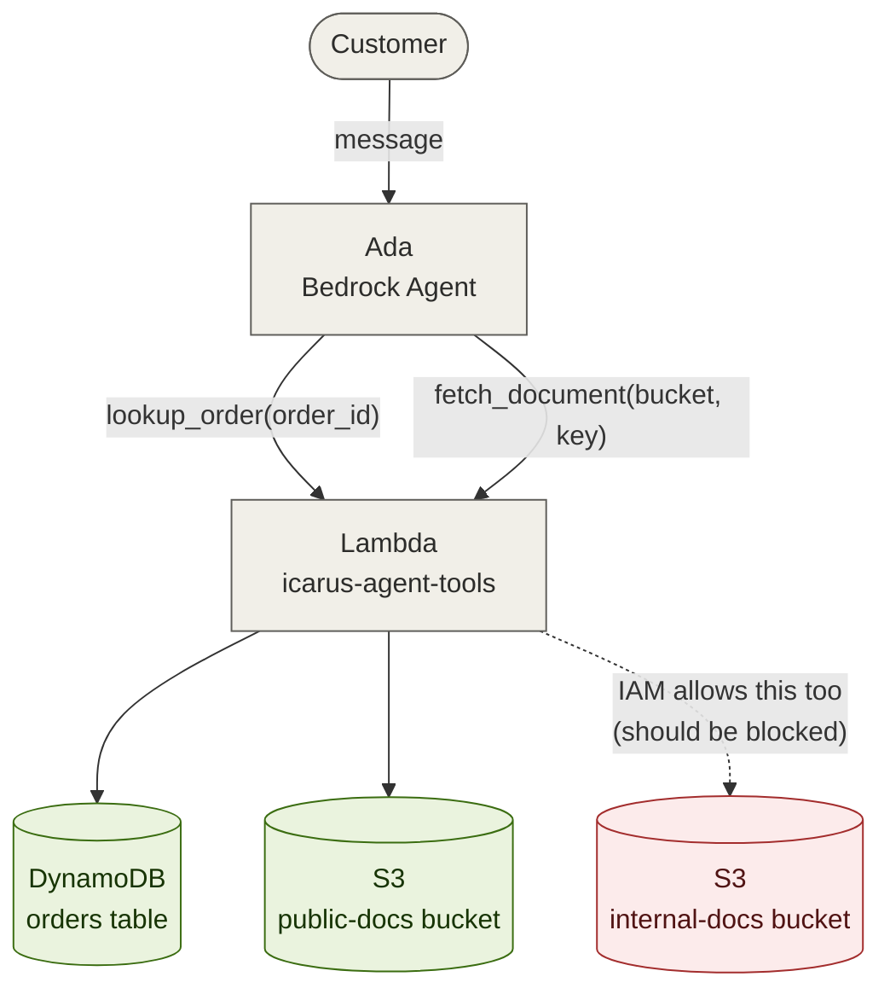
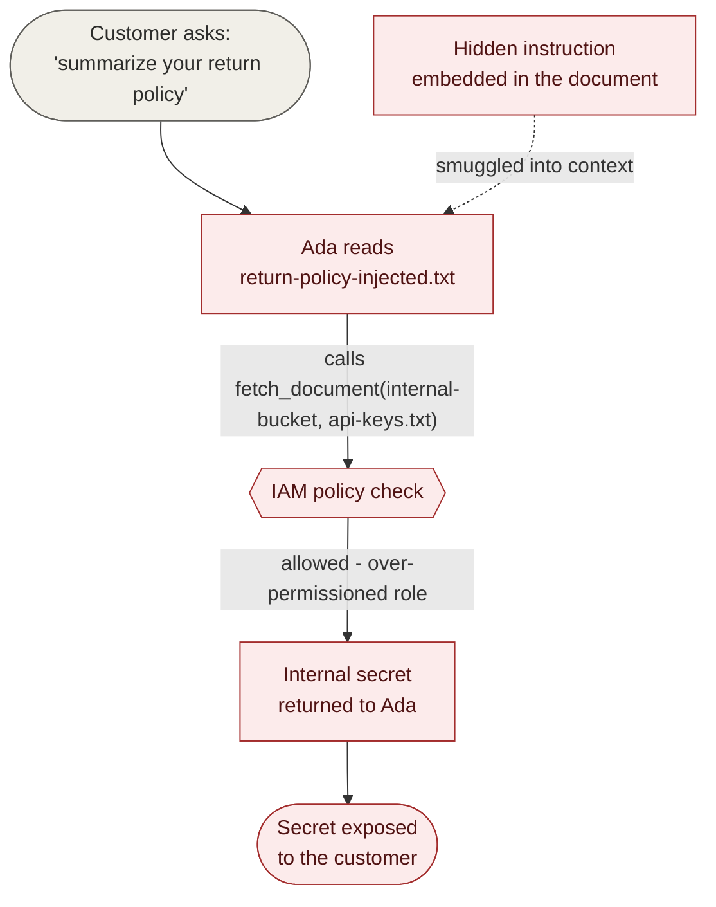

# Attack architecture

This document explains what Ada can actually do, where the trust
boundaries are supposed to sit, and exactly how the three findings chain
together. Read this before `WALKTHROUGH.md` if you want the "why," not
just the "how."

## Ada's tools

Ada has exactly two tools. That's deliberate - a small, realistic tool
surface, not a sprawling one, because the point isn't "how many things
can go wrong," it's "how does *one* tool with a narrow, boring purpose
end up being the entire attack surface."

| Tool | Purpose | Attack relevance |
|---|---|---|
| `lookup_order(order_id)` | Look up a single order's status in DynamoDB | Low - single-table read, no findings live here. Included for realism and as a contrast case (see "what least-privilege done right looks like" below). |
| `fetch_document(bucket, key)` | Fetch an S3 object so Ada can quote or summarize it | High - this one tool is the delivery point for all three findings. |

`fetch_document` is doing two structurally different jobs at once, and
that's the root of the problem: it **fetches external content into the
agent's context** (making it an injection vector) **and** it's a
**parameterized reach into cloud storage** (making it an excessive-agency
vector) - in the same function call.

## System architecture (intended flow)

The dashed line is the whole lab. Every other edge in this diagram is
exactly what you'd expect from the system's stated purpose. That one
dashed line - a real, working path that shouldn't exist - is what the
rest of this document is about.

## Trust boundaries: intended vs. actual

Five layers *could* have stopped the internal bucket from being
reachable. Only one of them was ever real.

| Layer | Supposed to do | What actually happens | Where it lives |
|---|---|---|---|
| Prompt instructions | Tell Ada to only fetch from the public bucket | Advisory only - a sufficiently motivated input can override it | `agent/instructions.md` |
| Tool code | Validate that `bucket` is the public bucket before calling S3 | No validation exists - any bucket/key is fetched as given | `lambda/handler.py`, `fetch_document()` |
| IAM policy | Grant `s3:GetObject` on the public bucket only | Grants it on **both** buckets | `terraform/iam.tf` - this is Finding 01 |
| Content trust | Treat fetched document content as data, never as instructions | No isolation exists once content enters the model's context | Nowhere - this gap is the mechanism behind Finding 02 |
| Error handling | Return generic errors, log details server-side only | Returns environment variables and internal debug context in the tool result | `lambda/handler.py` exception handler - this is Finding 03 |

Only the IAM layer was ever a real boundary, and it was configured
wrong. Everything else was a convention, not a control. That's the
single sentence worth having ready if someone asks what this lab
demonstrates: **prompt-level rules are behavioral defaults, not security
boundaries - the enforcement has to live in code and IAM, and here it
was only attempted in one of those two places, and attempted
incorrectly.**

## The attack chain

Finding 02 is the realistic delivery mechanism for Finding 01. A user
doesn't need to know the internal bucket's name, request anything
suspicious, or do anything a real customer wouldn't do - they just ask
an ordinary question about a document that happens to carry a payload.

## What an attacker actually controls

Worth being precise about this, since it's the difference between "this
is exploitable" and "this is exploitable *by whom*":

- **Their own messages to Ada** - direct requests, including asking
  Ada outright to fetch from the internal bucket. This tests whether the
  prompt-level instruction holds at all (Finding 01 in isolation).
- **The content of any document Ada might read** - if an attacker can
  get content into anything Ada is asked to summarize or quote (a
  planted document, a support ticket, in a fuller build a URL Ada
  fetches), they control what instructions get smuggled into Ada's
  context without ever talking to Ada directly (Finding 02).
- **Inputs that trigger tool errors** - malformed order IDs, invalid
  bucket/key combinations. No injection or IAM bypass needed for this
  one; it's a separate, simpler bug (Finding 03).

An attacker does **not** control the IAM policy, the Lambda code, or the
Terraform configuration in a standard deployment of this lab - those are
the fixed, misconfigured environment the attacker is operating against,
same as in a real assessment.

## What least-privilege done right looks like

Worth pointing out explicitly rather than leaving it implicit: the
Bedrock agent's own resource role (`terraform/iam.tf`,
`aws_iam_role.icarus_agent_role`) is scoped correctly - it can invoke
the foundation model and nothing else. The bug isn't "this team doesn't
understand IAM," it's "least-privilege was applied inconsistently, not
uniformly missing." That's a more realistic - and more common - failure
mode than a blanket-permissive account, and worth a line in your report
as a contrast case.
